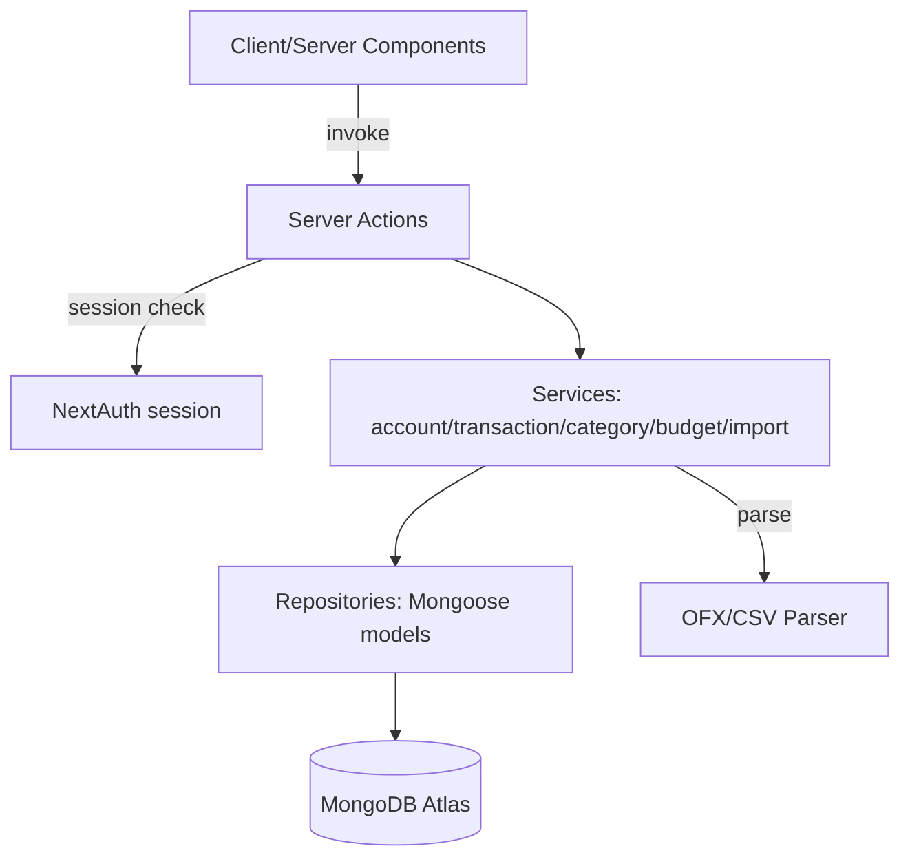

# Moni MVP Design

**Spec**: `.specs/features/moni-mvp/spec.md`
**Status**: Draft

---

## Architecture Overview

Monólito Next.js (App Router, TypeScript) hospedado na Vercel, com MongoDB Atlas via Mongoose. A UI (Server Components + Client Components) chama **Server Actions** diretamente — sem camada REST própria — que orquestram **services** (regras de negócio: saldo, dedup, orçamento) sobre **repositories** (acesso a dados via Mongoose). Autenticação via NextAuth.js (Credentials Provider, sessão JWT em cookie).



**Por que Server Actions em vez de API Routes REST:** app é single-user, sem consumidor externo hoje (mobile futuro está fora de escopo). Server Actions eliminam a duplicação de contrato (validação + tipos) entre cliente e servidor e reduzem código a manter. Se um dia precisar de API pública, pode-se expor Route Handlers finos que chamam os mesmos services (a camada de services já é agnóstica de transporte).

---

## Code Reuse Analysis

Projeto greenfield (sem código prévio) — nada a reaproveitar ainda. Esta seção documenta os pontos de integração que o design cria para reuso interno futuro:

### Integration Points

| System | Integration Method |
| ------ | ------------------- |
| MongoDB Atlas | Conexão única via `lib/db/connect.ts` (cache de conexão entre invocações serverless, padrão Mongoose+Next.js) |
| NextAuth.js | `lib/auth/options.ts` exporta `authOptions`; `auth()` helper usado em toda Server Action para obter `userId` da sessão |
| Services | Toda regra de negócio (saldo, dedup, orçamento) vive em `services/`, chamada tanto por Server Actions quanto (futuramente) por Route Handlers, sem duplicação |

---

## Components

### Auth Module

- **Purpose**: Cadastro, login, sessão.
- **Location**: `app/(auth)/`, `lib/auth/options.ts`, `services/user.service.ts`
- **Interfaces**:
  - `registerUser(input: {name, email, password}): Promise<User>` — hashea senha (bcrypt), cria usuário, rejeita email duplicado
  - `authOptions.providers[0].authorize(credentials)` — valida email/senha, retorna sessão ou `null`
- **Dependencies**: `bcrypt`, `next-auth`, `UserRepository`
- **Reuses**: n/a (base do projeto)

### Account Service

- **Purpose**: CRUD de contas e mutação atômica de saldo.
- **Location**: `services/account.service.ts`, `repositories/account.repository.ts`
- **Interfaces**:
  - `createAccount(userId, input): Promise<Account>`
  - `updateAccount(userId, accountId, input): Promise<Account>` — nunca altera `balance` diretamente
  - `deleteAccount(userId, accountId): Promise<void>` — lança erro `AccountHasTransactionsError` se houver transações vinculadas
  - `adjustBalance(accountId, deltaCents, session?): Promise<void>` — usa `$inc` atômico do Mongoose, aceita `ClientSession` para transações multi-documento
- **Dependencies**: `AccountRepository`, `TransactionRepository` (para checar vínculo antes de excluir)
- **Reuses**: `lib/db/connect.ts`

### Transaction Service

- **Purpose**: Regra central — criar/editar/excluir transações mantendo saldo consistente (reversão + reaplicação).
- **Location**: `services/transaction.service.ts`, `repositories/transaction.repository.ts`
- **Interfaces**:
  - `createTransaction(userId, input): Promise<Transaction>` — se `isPaid`, chama `adjustBalance` (INCOME: +amount na conta; EXPENSE: -amount; TRANSFER: -amount origem, +amount destino) dentro de uma transação Mongo (`session.withTransaction`)
  - `updateTransaction(userId, txId, input): Promise<Transaction>` — reverte efeito antigo (se estava paga) e aplica o novo (se ficar paga), tudo na mesma transação Mongo
  - `deleteTransaction(userId, txId): Promise<void>` — reverte efeito se estava paga
  - `setPaidStatus(userId, txId, isPaid): Promise<Transaction>` — aplica/reverte efeito no saldo
  - `listTransactions(userId, filters): Promise<Transaction[]>`
- **Dependencies**: `TransactionRepository`, `AccountService.adjustBalance`, `CategoryRepository` (validar categoria pertence ao usuário)
- **Reuses**: `Account Service`

**Nota de implementação (mitiga concorrência/atomicidade):** toda mutação que altera saldo usa `mongoose.startSession()` + `withTransaction()` envolvendo o `findOneAndUpdate` com `$inc` no saldo e o write da transação, garantindo que ambos persistam juntos ou nenhum persista. MongoDB Atlas (cluster, não standalone) suporta transações multi-documento nativamente.

### Category Service

- **Purpose**: CRUD de categorias.
- **Location**: `services/category.service.ts`, `repositories/category.repository.ts`
- **Interfaces**:
  - `createCategory(userId, input): Promise<Category>` — rejeita nome duplicado (índice único composto `userId+name`)
  - `deleteCategory(userId, categoryId): Promise<void>` — bloqueia se houver transações vinculadas
- **Dependencies**: `CategoryRepository`, `TransactionRepository`

### Budget Service

- **Purpose**: Limite mensal por categoria + cálculo de progresso/estouro.
- **Location**: `services/budget.service.ts`, `repositories/budget.repository.ts`
- **Interfaces**:
  - `setBudget(userId, categoryId, limitCents): Promise<Budget>` — um registro por categoria (recorrente mensal, sem campo mês/ano — se precisar variar por mês no futuro, é extensão aditiva)
  - `getMonthlyBudgetProgress(userId, month, year): Promise<BudgetProgress[]>` — junta `Budget` com soma de `EXPENSE` pagas do mês por categoria
- **Dependencies**: `BudgetRepository`, `TransactionRepository`

### Import Service (OFX/CSV)

- **Purpose**: Parsear arquivo, classificar linhas (gasto normal vs. TRANSFER para cofrinho/investimento), deduplicar contra transações existentes, criar transações em lote, aplicando auto-categorização por comerciante quando aplicável.
- **Location**: `services/import.service.ts`, `lib/parsers/ofx.ts`, `lib/parsers/csv.ts`
- **Interfaces**:
  - `parseOfx(fileBuffer): ParsedTransaction[]`
  - `parseCsv(fileBuffer, columnMapping): ParsedTransaction[]`
  - `parseBrazilianCurrencyToCents(value: string): number` — normaliza um valor monetário no formato brasileiro para centavos (inteiro com sinal)
  - `classifyPicPayRow(row: ParsedTransaction): { type: 'INCOME' | 'EXPENSE' | 'TRANSFER'; targetAccountName?: string }` (IMP-02) — decide o roteamento de uma linha antes de virar transação:
    1. Se a descrição contiver "Dinheiro guardado No cofrinho X" → `{ type: 'TRANSFER', targetAccountName: normalize(X) }` (origem → conta do cofrinho X, tipo `SAVINGS`)
    2. Se a descrição contiver "Dinheiro resgatado Do cofrinho X" → `{ type: 'TRANSFER', targetAccountName: normalize(X) }`, mas com direção invertida (conta do cofrinho X → origem) na hora de montar a transação
    3. Se a descrição/tipo contiver "Pix enviado" E o campo origem/destino contiver (case-insensitive) `"RICO"` ou `"XP"` → `{ type: 'TRANSFER', targetAccountName: 'Investimentos' }` (tipo `INVESTMENT`)
    4. Caso contrário → `{ type: sinal do valor (INCOME/EXPENSE) }` (comportamento herdado de IMP-01)
  - `resolveOrCreateAccountByName(userId, name, accountType): Promise<Account>` — idempotente: normaliza o nome (lowercase + trim + espaços colapsados), busca conta existente do usuário com esse nome normalizado; se achar, reutiliza (independente do `type` salvo, para não duplicar por type divergente); se não achar, cria uma nova conta `type = accountType` com o nome original (não normalizado) e `balance = 0`. Chamado por `importTransactions` para cada `targetAccountName` retornado por `classifyPicPayRow`, dentro da mesma transação Mongo do import (evita duas linhas do mesmo arquivo criarem duas contas "Cofrinho X" em paralelo)
  - `importTransactions(userId, accountId, parsed: ParsedTransaction[]): Promise<{imported: number, skipped: number}>` — para cada linha: (a) aplica `classifyPicPayRow`; linhas TRANSFER resolvem/criam a conta alvo via `resolveOrCreateAccountByName` e nunca recebem `categoryId` (TRANSFER não tem categoria, IMP-02 AC5); (b) para linhas que seguem INCOME/EXPENSE normais, consulta `merchantCategoryRule.service.suggestCategory(userId, description)` (CAT-02) e aplica a `categoryId` retornada, ou deixa vazia se não houver regra; (c) normaliza descrição (`lowercase` + trim + colapsa espaços), monta chave de dedup `accountId+date+amountCents+descNormalized`, consulta existentes em lote (`$in`), filtra duplicatas; (d) insere o restante e ajusta saldo de cada conta envolvida (origem e, quando houver, conta alvo de TRANSFER) uma única vez com a soma líquida
- **Dependencies**: `TransactionRepository`, `AccountRepository`/`AccountService.adjustBalance`, `MerchantCategoryRuleService.suggestCategory` (CAT-02), biblioteca `ofx-js` (ou equivalente) para parsing OFX — **a confirmar na fase de Tasks/implementação via Context7/docs oficiais antes de fixar a dependência exata** (Knowledge Verification Chain Step 3/4)
- **Reuses**: `Transaction Service` (mesma regra de valores em centavos), `Account Service` (criação/reuso de conta)

**Normalização de valor monetário brasileiro (`parseBrazilianCurrencyToCents`)**:

O CSV real de referência (formato PicPay, ver `test-fixtures/csv-imports/picpay-sample.csv` — não colar conteúdo, apenas o formato) traz a coluna `valor` como string, ex.: prefixo `R$`, ponto como separador de milhar, vírgula como separador decimal, e sinal antes do `R$`. O sinal negativo usa o caractere Unicode MINUS SIGN (`−`, U+2212), não o hífen ASCII (`-`, U+002D); o sinal positivo usa `+` ASCII normal. Algoritmo:

1. Trim da string.
2. Detectar sinal: se o primeiro caractere for `−` (U+2212) ou `-` (U+002D, aceito por robustez), sinal = negativo; se for `+` ou ausente, sinal = positivo.
3. Remover o(s) caractere(s) de sinal, o prefixo `R$` e espaços.
4. Remover todo `.` (separador de milhar).
5. Substituir `,` por `.` (separador decimal vira o padrão de parsing numérico).
6. Fazer parse do número resultante como float, multiplicar por 100 e arredondar (`Math.round`) para obter centavos inteiros.
7. Aplicar o sinal detectado no passo 2 ao resultado final.

Classificação INCOME vs EXPENSE (CSV e OFX): determinada exclusivamente pelo sinal do valor normalizado (positivo → INCOME, negativo → EXPENSE), nunca pelo texto livre da coluna `tipo`/similar — mesmo quando essa coluna existir com valores descritivos (ex. "Pix enviado", "Pix recebido", "Pagamento realizado"). Essa coluna livre pode compor a `description` (concatenada com `origem/destino`), mas não deve alimentar nenhuma lógica de classificação ou de categoria automática (spec IMP-01 AC6: importação nunca categoriza).

O mapeamento de colunas genérico (`columnMapping` em `parseCsv`) continua válido para bancos/formatos que não usem esse padrão brasileiro — `parseBrazilianCurrencyToCents` é aplicado apenas quando a coluna de valor mapeada estiver nesse formato (detectável por presença de `R$` ou dos sinais unicode/ASCII descritos); caso contrário, o parser deve cair para um parse numérico genérico (ex. `Number(value)` após normalização mínima).

Coluna `hora` (quando presente, separada de `data`, como no CSV PicPay): descartada — `Transaction.date` é `Date` sem uso de horário no domínio, então apenas `data` é usada para montar a data da transação importada.

**Risco flagado:** parsing de OFX é notoriamente inconsistente entre bancos (encoding, formato de data). Mitigação: tratar erro de parse como falha total do arquivo (spec IMP-01 AC4), nunca importar parcialmente um arquivo malformado; validar biblioteca real via Context7/docs antes de implementar (nunca assumir API).

**Risco/decisão flagada:** a coluna de texto livre tipo `tipo` (ex. "Pix enviado", "Pix recebido", "Dinheiro resgatado") não deve ser usada para inferir categoria automaticamente — IMP-01 AC6 já determina que a importação nunca categoriza (fica "Sem categoria" até o usuário categorizar manualmente depois).

### Merchant Category Learning (CAT-02)

- **Purpose**: Aprender e reaplicar a categoria de um comerciante a partir da categorização manual do usuário, sem ML/fuzzy matching — só substring/match exato de `merchantKey` normalizado. Inclui uma tela de revisão para categorizar em lote comerciantes ainda sem regra e para editar regras já existentes.
- **Location**: `services/merchant-category-rule.service.ts`, `repositories/merchant-category-rule.repository.ts`, `models/MerchantCategoryRule.ts`, `app/(dashboard)/merchants/page.tsx`, `app/(dashboard)/merchants/actions.ts`
- **Interfaces**:
  - `normalizeMerchantKey(description: string): string` — reaproveita a mesma normalização do dedup de IMP-01 (`lowercase` + trim + espaços colapsados)
  - `upsertRuleFromCategorization(userId, description, categoryId): Promise<MerchantCategoryRule>` — chamado por `transaction.service` toda vez que uma transação EXPENSE/INCOME é criada/editada com `categoryId` definido manualmente (não quando a categoria vem de uma sugestão automática já aceita sem alteração, para evitar reforçar loop — mas se o usuário confirmar/aceitar a sugestão isso também conta como categorização manual válida, é upsert idempotente de qualquer forma)
  - `suggestCategory(userId, description): Promise<ObjectId | null>` — consulta a regra para o `merchantKey` da descrição; usado por (a) `import.service` para auto-aplicar, e (b) pelo formulário de criação manual de transação para pré-selecionar/sugerir
  - `listUncategorizedMerchants(userId): Promise<{ merchantKey: string, sampleDescription: string, affectedCount: number }[]>` — agrega (via Mongoose aggregation em `Transaction`) os `merchantKey` distintos de transações EXPENSE/INCOME do usuário sem `categoryId` e sem regra `MerchantCategoryRule` correspondente, com a contagem de transações afetadas
  - `listExistingRules(userId): Promise<(MerchantCategoryRule & { categoryName: string })[]>` — lista as regras já criadas, com o nome da categoria atual, para a seção "Regras existentes" da tela
  - `categorizeMerchant(userId, merchantKey, categoryId): Promise<{ rule: MerchantCategoryRule, updatedCount: number }>` — usado tanto para criar a regra de um comerciante "sem regra ainda" quanto para editar uma regra existente (upsert); em ambos os casos, SEMPRE reaplica em lote: atualiza (`updateMany` equivalente, escopado por `userId` e `merchantKey` normalizado) o `categoryId` de **todas** as transações existentes do usuário com aquele `merchantKey`, quer estivessem sem categoria (caso "sem regra ainda") quer estivessem com a categoria antiga da regra que está sendo editada (caso "editar regra") — decisão de design: reaplicar também na edição, pela mesma razão de consistência (a regra é a fonte de verdade do comerciante; deixar transações antigas com a categoria anterior geraria divergência silenciosa entre a regra e o histórico)
- **Dependencies**: `TransactionRepository` (agregação de merchants sem categoria + update em lote escopado por `userId`), `CategoryRepository` (validar categoria pertence ao usuário)
- **Reuses**: normalização de descrição já definida em `Import Service`/IMP-01

**Tela `/merchants` (CAT-02)**: duas seções — "Sem regra ainda" (lista `listUncategorizedMerchants`, cada linha com descrição-exemplo, contagem de transações afetadas e um seletor de categoria; ao confirmar, chama `categorizeMerchant`) e "Regras existentes" (lista `listExistingRules`, cada linha com opção de trocar a categoria, reaplicando em lote da mesma forma).

### Dashboard Service

- **Purpose**: Agregações para saldo consolidado e resumo mensal.
- **Location**: `services/dashboard.service.ts`
- **Interfaces**:
  - `getConsolidatedBalance(userId): Promise<number>` — soma `balance` de todas as contas
  - `getMonthlySummaryByCategory(userId, month, year): Promise<CategorySummary[]>` — aggregation pipeline Mongoose agrupando `EXPENSE`/`INCOME` pagas por `categoryId`
- **Dependencies**: `AccountRepository`, `TransactionRepository`, `Budget Service` (para anexar progresso de orçamento no resumo)

---

## Data Models

```typescript
// models/User.ts
interface User {
  _id: ObjectId
  name: string
  email: string // unique index
  passwordHash: string
  createdAt: Date
}

// models/Account.ts
interface Account {
  _id: ObjectId
  userId: ObjectId // index
  name: string // max 60 chars
  type: 'CHECKING' | 'CREDIT' | 'SAVINGS' | 'CASH' | 'INVESTMENT' // INVESTMENT: extensão aditiva (ACC-03)
  balance: number // centavos, inteiro; para INVESTMENT, é apenas o valor aportado (sem cotação de mercado)
  createdAt: Date
}

// models/Category.ts
interface Category {
  _id: ObjectId
  userId: ObjectId
  name: string // max 60 chars; unique index (userId, name)
  color: string
  iconType: string
}

// models/Transaction.ts
interface Transaction {
  _id: ObjectId
  userId: ObjectId // index
  accountId: ObjectId // origem (ou única conta para INCOME/EXPENSE)
  toAccountId?: ObjectId // somente TRANSFER
  categoryId?: ObjectId // obrigatório para INCOME/EXPENSE; ausente para TRANSFER
  type: 'INCOME' | 'EXPENSE' | 'TRANSFER'
  amount: number // centavos, inteiro, > 0
  date: Date
  description: string // max 200 chars
  isPaid: boolean // TRANSFER sempre true
  createdAt: Date
}
// index composto (accountId, date, amount, description) para dedup de import

// models/Budget.ts
interface Budget {
  _id: ObjectId
  userId: ObjectId
  categoryId: ObjectId // unique index (userId, categoryId)
  limitCents: number // > 0
  createdAt: Date
}

// models/MerchantCategoryRule.ts (CAT-02)
interface MerchantCategoryRule {
  _id: ObjectId
  userId: ObjectId // index
  merchantKey: string // normalizado: lowercase + trim + espaços colapsados (mesma normalização do dedup IMP-01); unique index (userId, merchantKey)
  categoryId: ObjectId
  updatedAt: Date // última vez que o usuário recategorizou esse comerciante
}
```

**Relationships**: `Account`, `Category`, `Transaction`, `Budget`, `MerchantCategoryRule` referenciam `User` via `userId`. `Transaction` referencia `Account` (1 ou 2x) e opcionalmente `Category`. `Budget` referencia `Category` 1:1. `MerchantCategoryRule` referencia `Category` 1:1 e é chaveada por (`userId`, `merchantKey`).

---

## Error Handling Strategy

| Error Scenario | Handling | User Impact |
| --------------- | -------- | ----------- |
| Email duplicado no cadastro | Service lança `DuplicateEmailError`; Server Action retorna `{error}` tipado | Mensagem "email já cadastrado" no form |
| Credenciais inválidas | `authorize()` retorna `null` | NextAuth exibe erro genérico "credenciais inválidas" |
| Acesso a recurso de outro usuário | Repository sempre filtra por `userId` na query; se não encontrar, lança `NotFoundError` | 404 / "não encontrado", nunca vaza existência |
| Exclusão de conta/categoria com vínculos | Service verifica antes via `TransactionRepository.existsFor(...)`, lança `HasDependentsError` | Mensagem explicando o bloqueio |
| Falha de conexão MongoDB Atlas | `lib/db/connect.ts` propaga erro; error boundary global / try-catch nas Server Actions retorna `{error: "serviço indisponível"}` | Mensagem genérica, sem stack trace |
| Arquivo de importação malformado ou >5MB | `Import Service` valida antes de parsear; lança `InvalidImportFileError` | Mensagem indicando o problema, nada é importado |
| Concorrência em `adjustBalance` | `$inc` atômico dentro de `withTransaction` | Transparente ao usuário |

---

## Risks & Concerns

| Concern | Location (file:line) | Impact | Mitigation |
| ------- | -------------------- | ------ | ---------- |
| MongoDB Atlas free tier (M0) não suporta réplica multi-região e tem limites de conexão simultânea | `lib/db/connect.ts` (a criar) | Pode limitar picos de uso, mas M0 é replica set (suporta transações) | Usar cache de conexão global (padrão Next.js serverless) para evitar exaustão de conexões; confirmar tier Atlas antes de assumir suporte a transações |
| Biblioteca de parsing OFX ainda não escolhida/validada | `services/import.service.ts` (a criar) | Risco de assumir API incorreta | Validar via Context7/docs oficiais na fase de Tasks antes de codar, nunca fabricar API |
| Transações multi-documento do Mongoose têm custo de performance vs. update simples | `services/transaction.service.ts` (a criar) | Latência um pouco maior por escrita | Aceitável para uso pessoal (baixo volume); revisar se volume crescer |
| Contas "fantasma" de cofrinho por variação de texto no extrato (ex.: "Cofrinho do Rô" vs "cofrinho do  Rô " vs "Cofrinho Rô") | `services/import.service.ts` (`resolveOrCreateAccountByName`, a criar) | Duplica contas que deveriam ser a mesma, fragmentando saldo do cofrinho | Normalizar nome (lowercase + trim + espaços colapsados) antes de comparar/buscar, igual à normalização de dedup do IMP-01; usuário pode mesclar manualmente se ainda assim divergir (fora de escopo automatizar merge de contas) |
| `merchantKey` colidindo para comerciantes diferentes com descrição parecida (ex.: "PAG*LOJA A" vs "PAG*LOJA B" truncados igual pelo banco) | `services/merchant-category-rule.service.ts` (a criar) | Categoria errada aplicada a um comerciante diferente | Aceito como risco conhecido do match literal (CAT-02 é deliberadamente simples, não ML); usuário pode corrigir editando a regra em `/merchants`, que reaplica em lote |
| Reaplicação em lote (`categorizeMerchant`) mexe em transações que já tinham outra categoria (caso "editar regra existente") | `services/merchant-category-rule.service.ts` (a criar) | Usuário pode não esperar que editar uma regra mude o histórico já categorizado | Documentado como decisão deliberada (consistência regra↔histórico); UI deve mostrar a contagem de transações afetadas antes de confirmar a troca |

---

## Tech Decisions (only non-obvious ones)

| Decision | Choice | Rationale |
| -------- | ------ | --------- |
| Transporte UI↔servidor | Server Actions (não API REST) | Single-user, sem consumidor externo hoje; menos boilerplate. Registrado como decisão de projeto (ver `.specs/STATE.md`) |
| Consistência de saldo | Mongoose transactions (`withTransaction`) em toda escrita que mexe em saldo | Evita saldo divergente por escrita parcial/concorrência, exigido pelo requisito de saldo sempre consistente |
| Valores monetários | Sempre inteiro em centavos, nunca `float` | Padrão para evitar erro de ponto flutuante em dinheiro |
| Orçamento | Um documento `Budget` por categoria (sem campo mês/ano) representando limite mensal recorrente | Simplicidade decidida no discuss: "limite mensal fixo", sem necessidade de variar mês a mês no MVP |
| UI/Estilo | Tailwind CSS + shadcn/ui, visual minimalista (ref. Nubank/Linear), tema claro por padrão; donut chart via `recharts` (mesma lib usada pelo componente `chart` do shadcn) para o resumo mensal por categoria | Decidido com o usuário em `context.md` durante a aprovação das Tasks |
| Parsing de OFX (IMP-01, T38) | `ofx-js@1.1.1` | Única biblioteca atual e mantida encontrada para parsing de OFX em Node/TypeScript sem dependências externas (`npm view ofx-js` — última publicação recente, zero `deps`, tipos TS inclusos). Expõe `parseStrict(data: string): ParsedOFX` (síncrono) retornando a árvore `OFX.BANKMSGSRSV1.STMTTRNRS.STMTRS.BANKTRANLIST.STMTTRN` (um `StatementTransaction` ou array deles) com `DTPOSTED` (string `OFXDateTime`, formato `YYYYMMDDHHMMSS[...]`), `TRNAMT` (string `OFXAmount`, sinal negativo = débito) e `NAME`/`MEMO` (descrição). Erros de parsing (arquivo malformado) lançam exceção nativa da lib, capturada e remapeada para `InvalidImportFileError` (IMP-01 AC4) |
| Parsing de CSV (IMP-01, T40) | `papaparse@5.7.0` | Biblioteca padrão de mercado para CSV em JS/TS, mantida, com suporte a cabeçalho e streaming; usada apenas para split de linhas/colunas — a normalização de moeda brasileira é lógica própria (`parseBrazilianCurrencyToCents`), não delegada à lib |
| Navegação mobile do header | Bottom navigation bar fixa (ícone + label curto) para viewport <768px, substituindo a lista horizontal de links de `components/layout/header.tsx`; o logo/topo continua como header fino no mobile, sem os links horizontais | Bottom nav é o padrão de apps financeiros mobile-first (Nubank, Inter etc.), mantém as ações principais a um toque do polegar, e é mais previsível em telas estreitas do que hambúrguer (que esconde a navegação atrás de mais um toque) ou tabs roláveis (que escondem itens fora da viewport sem indicação clara); coerente com o estilo minimalista já adotado (poucos itens de nav: Resumo, Transações, Contas, Categorias) |

> **Decisão de projeto**: a escolha "Server Actions + services/repositories" e "saldo sempre mutado via `$inc` atômico em transação Mongo" são convenções que toda feature futura deste projeto deve seguir. Registradas em `.specs/STATE.md` como AD-001 e AD-002.
